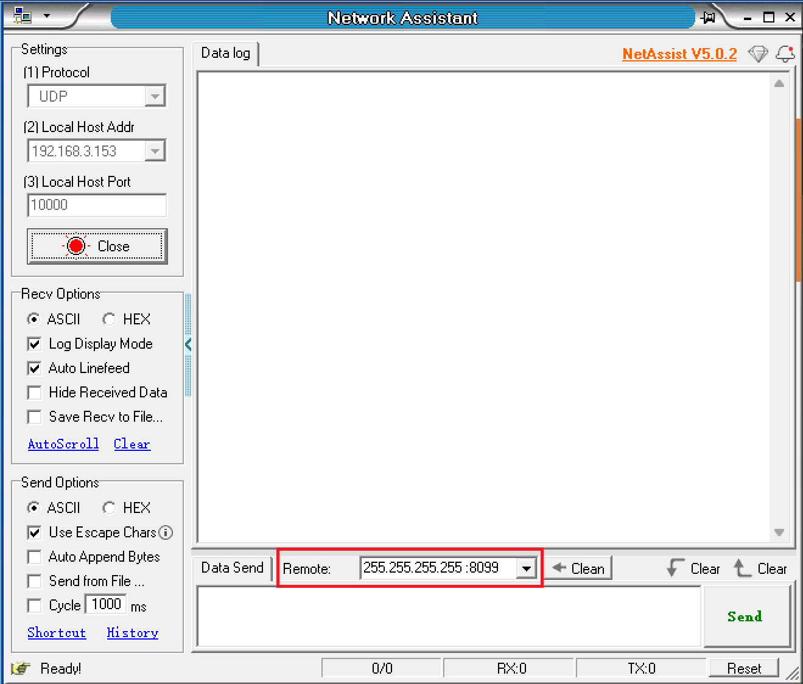
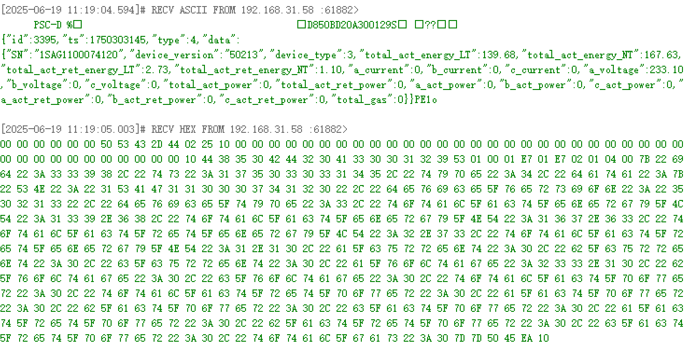
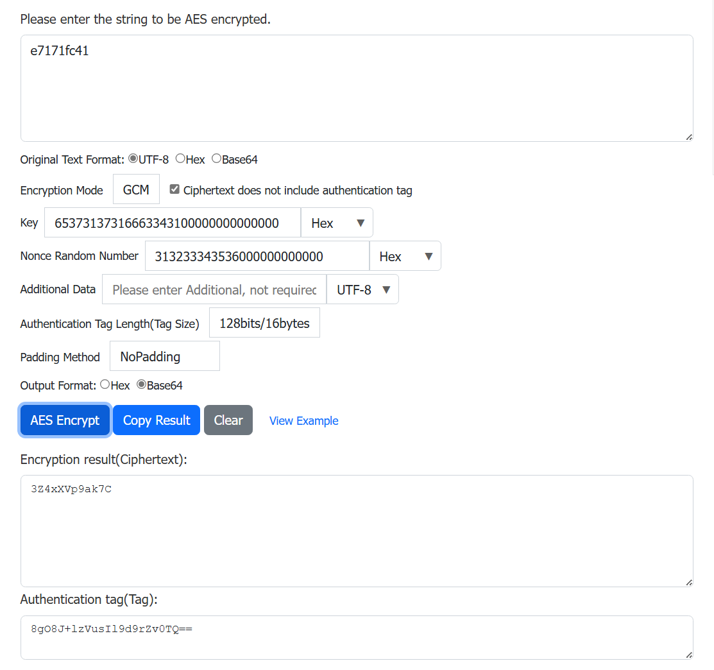
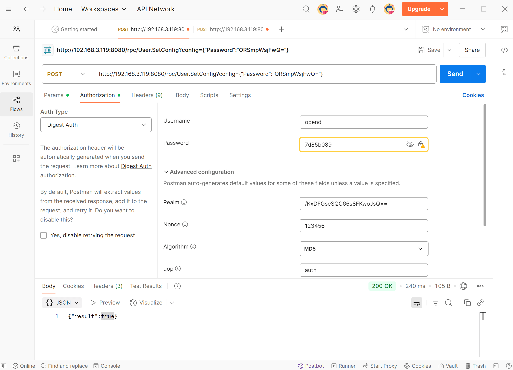

# OpenData

## 1. Introduction

OpenData is a lightweight communication framework designed for WiFi-based Solarman IoT devices (such as smart plug, meters, P1 readers, etc.). Devices connect to the local network via WiFi, supporting both data push and external query response mechanisms.

### Core Features

- **Device Data Acquisition**: Real-time retrieval of device basic information (model, firmware version, etc.) and measurement data.
- **Device Configuration Update**: Dynamic adjustment of device parameters and settings.

### Use Cases

1. **Push Device Data (UDP)**
    - Unencrypted: UDP broadcast to `255.255.255.255`
    - Device Key Encrypted: UDP broadcast to `255.255.255.255` (Coming soon)

2. **Receive External Query Requests (HTTP/HTTPS)**
    - HTTP: No encryption/authentication, plaintext transmission
    - HTTP + Digest: Digest authentication
    - HTTPS: TLS/SSL encryption (Coming soon)


## 2. Preparation

### 1. Install Tools

- Network debugging tool (e.g., [NetAssist](https://www.cmsoft.cn/resource/102.html)): For receiving UDP broadcasts.
- [Postman](https://www.getpostman.com/): For calling HTTP APIs to get device info or update configurations.

### 2. Enable API

Device API functionality is **disabled by default** and must be manually enabled before use.

### 3. Obtain IP Address

Choose one of the following four methods:

- Query via router admin interface
- View device details in Solarman Smart APP
- Check device info in Energy Ease

<details>
<summary>Obtain IP via UDP broadcast</summary>

1. Ensure the device and computer are on the same LAN.

2. Open the network debugging tool.

3. Select **UDP** protocol.
   

4. Select **Local Host Address**.
   

5. Set **Port** to **10000**.
   

6. Click **Open**.
   

7. Set remote host to broadcast address: **255.255.255.255:8099**.
   

8. Enter AT command in message box: **AT+IGDEVICEIP**.
   

9. Click **Send**.

10. Solarman devices on the same LAN will reply with their IP and SN.
    
</details>

## 3. UDP Usage Guide

### Enable Functionality

UDP is **disabled by default** and must be manually enabled.

### Unencrypted UDP

For devices supporting UDP broadcast, receive UDP packets to obtain device information.

| Device     | Broadcast Address & Port             | Frequency (ms) |
| ---------- | ------------------------------------ | -------------- |
| P1 Reader  | Address: 255.255.255.255; Port: 8088 | 500            |
| Smart Plug | Address: 255.255.255.255; Port: 8088 | 500            |
| Meter      | Address: 255.255.255.255; Port: 8088 | 200            |

**Steps**:

1. Ensure device and computer are on the same LAN.

2. Open network debugging tool.

3. Select **UDP** protocol.
   

4. Select your computer's **IP address** in the LAN.
   

5. Set local **port** to **8088**.
   

6. Click **Open** to start listening.
   

7. Select packet display format: ASCII/Hex.
   

8. Received packets will display in the receive area.
   

:::info Note
If no data is received, verify device and computer are on the same LAN and ensure firewall allows communication.
:::

### UDP Device Key Encryption

Coming soon

## 4. HTTP Usage Guide

### Request Structure

#### Request Methods

- **GET**: Request specified resource from server.
- **POST**: Request server to perform an action.

#### Request Address

```
http://{IP_ADDRESS}:8080/rpc/{API}
```

where:

- `{IP_ADDRESS}`: Device IP address.
- `{API}`: HTTP API to call.

### Request Examples

- Get device info:

```
GET http://192.168.31.213:8080/rpc/Sys.GetConfig
```

- Modify device name:

```
POST http://192.168.31.213:8080/rpc/Sys.SetConfig?config={"device":{"hostname":"admin"}}
```

### Digest Authentication

Digest authentication verifies user identity without transmitting plaintext passwords.

:::info Note
In HTTP+Digest mode, devices after first use or factory reset require default password change before using other APIs.
:::

#### Change Password

1. In Postman, select **Authorization** tab.
   

2. Select **Digest Auth** from **Auth Type** dropdown.
   

3. Use online AES tools to generate Base64-encoded password and tag:
   - **Required Tools**:
     - ASCII to Hex
     - Hex to Base64
     - AES_GCM Encryptor
   - **Parameters**:
     - Plaintext: New password
     - Key: Current password (Hex format, pad with `00` to 16 bytes).
       Example: `e7171fc41` → `65373137316663343100000000000000`
     - Nonce: Random value (Hex format, pad with `00` to 12 bytes).
       Example: `123456` → `313233343536000000000000`
     - Padding: NoPadding
   

4. Authentication parameters:

   | Field        | Value                             |
   | ------------ | --------------------------------- |
   | Username     | Default: `opend`                  |
   | Password     | Default device KEY                |
   | Realm        | AES128-GCM generated Tag (Base64) |
   | Nonce        | Same random value used in AES     |
   | Algorithm    | MD5                               |
   | qop          | auth                              |
   | Nonce Count  | Random value                      |
   | Client Nonce | Random value                      |
   | Opaque       | (Leave empty)                     |

5. Select **POST** method.
   

6. Request address:

  ```
  http://{IP_ADDRESS}:8080/rpc/User.SetConfig?config={"Password":"{PASSWORD}"}
  ```

  where:
    - `{IP_ADDRESS}`：Device IP address.
    - `{PASSWORD}`: AES128-GCM encrypted ciphertext (Base64).

  

7. Click **Send**.

  

  > &#x2705; **Success**
  >
  > Returns `{"result": true}` if password changed successfully.

#### Request Other APIs

1. Select **Authorization** tab in Postman.
  

2. Choose **Digest Auth**.
  

3. Fill parameters:

| Field        | Value                     |
| ------------ | ------------------------- |
| Username     | `opend`                   |
| Password     | New password              |
| Realm        | Random value              |
| Nonce        | Nonce from AES encryption |
| Algorithm    | MD5                       |
| qop          | auth                      |
| Nonce Count  | Random value              |
| Client Nonce | Random value              |
| Opaque       | (Leave empty)             |

### HTTPS

Coming soon

### Error Codes

| Code | Description                | Explanation                                                             |
| ---- | -------------------------- | ----------------------------------------------------------------------- |
| 400  | Bad Request                | Server cannot understand request format.                                |
| 401  | Unauthorized               | Authentication required. Provide valid credentials.                     |
| 403  | Forbidden                  | Server refuses action (typically permission issue).                     |
| 404  | Not Found                  | Resource not found or deleted.                                          |
| 405  | Method Not Allowed         | Incompatible method (e.g., write operation on read-only resource).      |
| 408  | Request Timeout            | Server timed out waiting for request. Retry later.                      |
| 409  | Conflict                   | Request conflicts with current resource state (e.g., concurrent edits). |
| 410  | Gone                       | Resource permanently deleted.                                           |
| 500  | Internal Server Error      | Server encountered unexpected error.                                    |
| 501  | Not Implemented            | Server does not support requested method.                               |
| 502  | Bad Gateway                | Invalid response received from upstream server.                         |
| 503  | Service Unavailable        | Server temporarily overloaded or in maintenance.                        |
| 504  | Gateway Timeout            | Upstream server response timeout.                                       |
| 505  | HTTP Version Not Supported | Server does not support HTTP version in request.                        |

## 5. HTTP API

| Component     | Description                                     |
| ------------- | ----------------------------------------------- |
| [Sys](#sys)   | Device model, firmware version, etc.            |
| [P1](#p1)     | Read gas/electricity data from P1 meter reader. |
| [Plug](#plug) | Read power metrics and control smart sockets.   |

### Sys

#### Get Device Info

- Request Example

```
GET http://192.168.31.213:8080/rpc/Sys.GetConfig
```

- Response Example

```json
{
    "device": {
        "hostname": "admin",
        "timezone": 480,
        "type": "",
        "sn": "2730890019",
        "mac": "E8FDF8DD9A76",
        "fw": "LSW3_01_E030_SS_00_00.00.00.03",
        "time": "2024-11-26 19:14:23",
        "time_stamp": 1732648463,
        "run_time": 839
    }
}
```


> **Method: Sys.GetConfig**
>
> - Returns
>
> | Parameter | Type   | Description                  |
> | --------- | ------ | ---------------------------- |
> | device    | object | See [Config](#config) table. |


#### Set Device Name/Timezone

- Request Example

```
POST http://192.168.31.213:8080/rpc/Sys.SetConfig?config={"device":{"hostname":"admin"}}
```

- Response Example

```json
{"result": true}
```

> **Method: Sys.SetConfig**
>
> - Parameters
>
> | Parameter | Type   | Description                                                           |
> | --------- | ------ | --------------------------------------------------------------------- |
> | config    | object | Only hostname and timezone are writable. See [Config](#config) table. |
>
> - Returns
>
> | Parameter | Type | Description                        |
> | --------- | ---- | ---------------------------------- |
> | result    | bool | `true`: success, `false`: failure. |


#### Config

| Parameter | Type   | Description               |
| --------- | ------ | ------------------------- |
| device    | object | Device config. See below. |


`device`


| Parameter  | Type   | Description                        | R/W |
| ---------- | ------ | ---------------------------------- | --- |
| hostname   | string | Device name                        | R/W |
| timezone   | int    | Timezone                           | R/W |
| type       | string | Device model                       | R   |
| sn         | string | Serial number                      | R   |
| mac        | string | MAC address                        | R   |
| fw         | string | Firmware version                   | R   |
| time       | string | Current time (YYYY-MM-DD HH:mm:ss) | R   |
| time_stamp | int    | Unix timestamp                     | R   |
| run_time   | int    | Uptime (seconds)                   | R   |


### P1

#### Get Meter Data (JSON)


- Request Example

```
GET http://192.168.31.213:8080/rpc/P1.JsonData
```

- Response Example

```json
{
    "SN": "E0036003765928016",
    "Device_Version ": "50",
    "Device_Type": 0,
    "Electricity delivered to client_low tariff": 53754.58,
    "Electricity delivered to client_normal tariff": 9818.93,
    "Electricity delivered by client_low tariff": 53754.58,
    "Electricity delivered by client_normal tariff": 9818.93,
    "AC_Phase-A_Current ": 12,
    "AC_Phase-B_Current": 0,
    "AC_Phase-C_Current": 0,
    "AC_Phase-A_Voltage": 237,
    "AC_Phase-B_Voltage": 237,
    "AC_Phase-C_Voltage": 236,
    " Actual electricity power delivered +P ": 0,
    " Actual electricity power received -P ": 2.94,
    "Instantaneous active power L1 +P": 0,
    "Instantaneous active power L2 +P": 0,
    "Instantaneous active power L3 +P": 0,
    "Instantaneous active power L1 -P": 2.95,
    "Instantaneous active power L2 -P": 0,
    "Instantaneous active power L3 -P": 0
}
```

> **Method: P1.JsonData**
>
> - Returns: JSON-formatted meter data.
>
> | Parameter                                     | Description                    | Unit |
> | --------------------------------------------- | ------------------------------ | ---- |
> | SN                                            | Meter SN                       | -    |
> | Device_Version                                | Meter version                  | -    |
> | Device_Type                                   | Meter model                    | -    |
> | Electricity delivered to client_low tariff    | Forward energy (low tariff)    | kWh  |
> | Electricity delivered to client_normal tariff | Forward energy (normal tariff) | kWh  |
> | Electricity delivered by client_low tariff    | Reverse energy (low tariff)    | kWh  |
> | Electricity delivered by client_normal tariff | Reverse energy (normal tariff) | kWh  |
> | AC_Phase-L1_Current                           | Phase A current                | A    |
> | AC_Phase-L2_Current                           | Phase B current                | A    |
> | AC_Phase-L3_Current                           | Phase C current                | A    |
> | AC_Phase-L1_Voltage                           | Phase A voltage                | V    |
> | AC_Phase-L2_Voltage                           | Phase B voltage                | V    |
> | AC_Phase-L3_Voltage                           | Phase C voltage                | V    |
> | Actual electricity power delivered +P         | Total forward active power     | kW   |
> | Actual electricity power received -P          | Total reverse active power     | kW   |
> | Instantaneous active power L1 +P              | Purchased power L1             | kW   |
> | Instantaneous active power L2 +P              | Purchased power L2             | kW   |
> | Instantaneous active power L3 +P              | Purchased power L3             | kW   |
> | Instantaneous active power L1 -P              | Grid feed-in power L1          | kW   |
> | Instantaneous active power L2 -P              | Grid feed-in power L2          | kW   |
> | Instantaneous active power L3 -P              | Grid feed-in power L3          | kW   |
> | Total Gas Consumption                         | Total gas consumption          | m³   |

#### Get Raw Meter Data

- Request Example

```
GET http://192.168.31.213:8080/rpc/P1.GetData
```

- Response Example

```json
{
    3:0.2.8(50)
    0-0:1.0.0(181106140429W)
    0-0:96.1.1(31333631353032362020202020202020)
    1-0:1.8.1(10830.511*kWh)
    1-0:1.8.2(002948.827*kWh)
    1-0:2.8.1(001285.951*kWh)
    1-0:2.8.2(002876.514*kWh)
    0-0:96.14.0(0002)
    1-0:1.7.0(21.100*kW)
    1-0:2.7.0(00.000*kW)
    0-0:96.7.21(00006)
    0-0:96.7.9(00003)
    1-0:99.97.0(1)(0-0:96.7.19)(180529135630S)(0000002451*s)
    1-0:32.32.0(00003)
    1-0:52.32.0(00002)
    1-0:72.32.0(00002)
    1-0:32.36.0(00001)
    1-0:52.36.0(00001)
    1-0:72.36.0(00001)
    0-0:96.13.0()
    1-0:32.7.0(236.0*V)
    1-0:52.7.0(232.6*V)
    1-0:72.7.0(235.1*V)
    1-0:31.7.0(002*A)
    1-0:51.7.0(000*A)
    1-0:71.7.0(000*A)
    1-0:21.7.0(00.000*kW)
    1-0:41.7.0(00.033*kW)
    1-0:61.7.0(00.132*kW)
    1-0:22.7.0(00.676*kW)
    1-0:42.7.0(00.000*kW)
    1-0:62.7.0(00.000*kW)
    0-1:24.1.0(003)
    0-1:96.1.0(4730303339303031373030343630313137)
    0-1:24.2.1(210606140010W)(02569.646*m3)
    !1F28
}
```

> **Method: P1.GetData**
>
> - Returns: Raw meter data.

### Plug

#### Get Power Consumption

- Request Example

```
GET http://192.168.31.213:8080/rpc/Plug.GetData
```

- Response Example

```json
{
    "voltage": 230,
    "electric_current": 0,
    "positive_active_energy": 1.730654,
    "reverse_active_energy": 0.000000,
    "power": 1.217517
}
```

> **Method: Plug.GetData**
>
> - Returns
>
> | Parameter              | Type  | Description           | Unit |
> | ---------------------- | ----- | --------------------- | ---- |
> | voltage                | int   | Voltage               | V    |
> | electric_current       | int   | Current               | A    |
> | positive_active_energy | float | Forward active energy | kWh  |
> | reverse_active_energy  | float | Reverse active energy | kWh  |
> | power                  | float | Active power          | W    |

#### Get Plug Status

- Request Example

```
GET http://192.168.31.213:8080/rpc/Plug.GetStatus
```

- Response Example

```json
{"switch_status": "on"}
```

> **Method: Plug.GetStatus**
>
> - Returns
>
> | Parameter     | Type   | Description               |
> | ------------- | ------ | ------------------------- |
> | switch_status | string | `on`: open, `off`: closed |

#### Set Plug Status

Request Example

```
POST http://192.168.31.213:8080/rpc/Plug.SetStatus?config={"switch_status":"on"}
```

- Response Example

```json
{"result": true}
```

> **Method: Plug.SetStatus**
>
> - Parameters
>
> | Parameter | Type   | Description                                  |
> | --------- | ------ | -------------------------------------------- |
> | config    | object | Sets socket status. See [Config](#config-1). |
>
> - Returns
>
> | Parameter | Type | Description                        |
> | --------- | ---- | ---------------------------------- |
> | result    | bool | `true`: success, `false`: failure. |

#### Config

| Parameter                       | Type   | Description               | Unit | R/W |
| ------------------------------- | ------ | ------------------------- | ---- | --- |
| voltage                         | int    | Voltage                   | V    | R   |
| current                         | int    | Current                   | A    | R   |
| Electricity delivered to client | float  | Forward active energy     | kWh  | R   |
| Electricity delivered by client | float  | Reverse active energy     | kWh  | R   |
| Active power                    | float  | Active power              | W    | R   |
| switch_status                   | string | `on`: open, `off`: closed | -    | R/W |


### Meter

#### Get Meter Data (JSON)

- Request Example

```
GET http://192.168.31.213:8080/rpc/Meter.JsonData
```

- Response Example

```json
{
    "SN": "3310500113",
    "voltage": 229.87,
    "current": 0.66,
    "active power": 133.50,
    "apparent power": 209.60,
    "reactive power": -29.80,
    "power factor": 0.63,
    "frequency": 50.03,
    "total_act_energy": 3.53,
    "total_act_ret_energy": 0.18
}
```

> **Method: Meter.JsonData**
>
> - Returns: JSON-formatted meter data.
>
> Single-phase Meter JSON Data
>
> | Parameter            | Description                    | Unit |
> | -------------------- | ------------------------------ | ---- |
> | SN                   | Device SN                      | -    |
> | current              | Current                        | A    |
> | voltage              | Voltage                        | V    |
> | frequency            | AC frequency                   | Hz   |
> | power factor         | Power factor                   | -    |
> | active Power         | Forward/Reverse active power   | W    |
> | apparent power       | Forward/Reverse apparent power | W    |
> | reactive power       | Forward/Reverse reactive power | W    |
> | total_act_energy     | Total forward active energy    | kWh  |
> | total_act_ret_energy | Total reverse active energy    | kWh  |


## 6. Devices

### P1 Reader

The P1 Reader (P1-2W) connects directly to a single P1 meter via RJ12 interface, continuously collecting meter status and electricity data for long-term monitoring. It transmits data over WiFi to local/cloud platforms, visualizing real-time status and historical trends.

Supported Components:

- Sys
- P1

### Smart Plug

The Smart Plug (SP-2W-EU) supports home energy monitoring with bidirectional metering and remote control. It uploads energy data via WiFi, allowing users to remotely control appliances and monitor usage via apps.

Supported Components:

- Sys
- Plug

### Meter

The meter is designed for residential/small commercial bidirectional metering. It is installed on DIN rails (35mm) using split-core CTs and uploads data via WiFi/Ethernet for detailed energy analysis.

Models (MR1: Single-phase, MR3:Three-phase):

- MR1-D5-WR
- MR1-D5-W

Supported Components:

- Sys
- Meter
