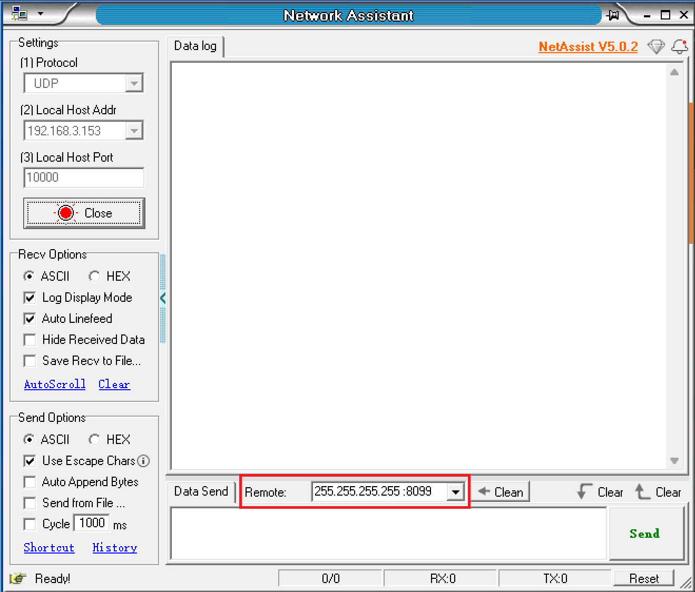
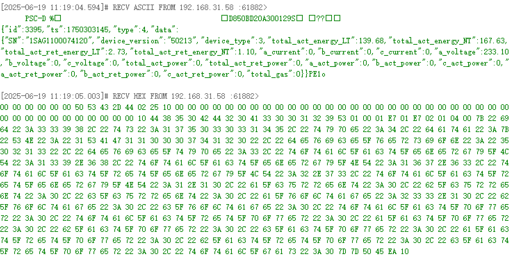
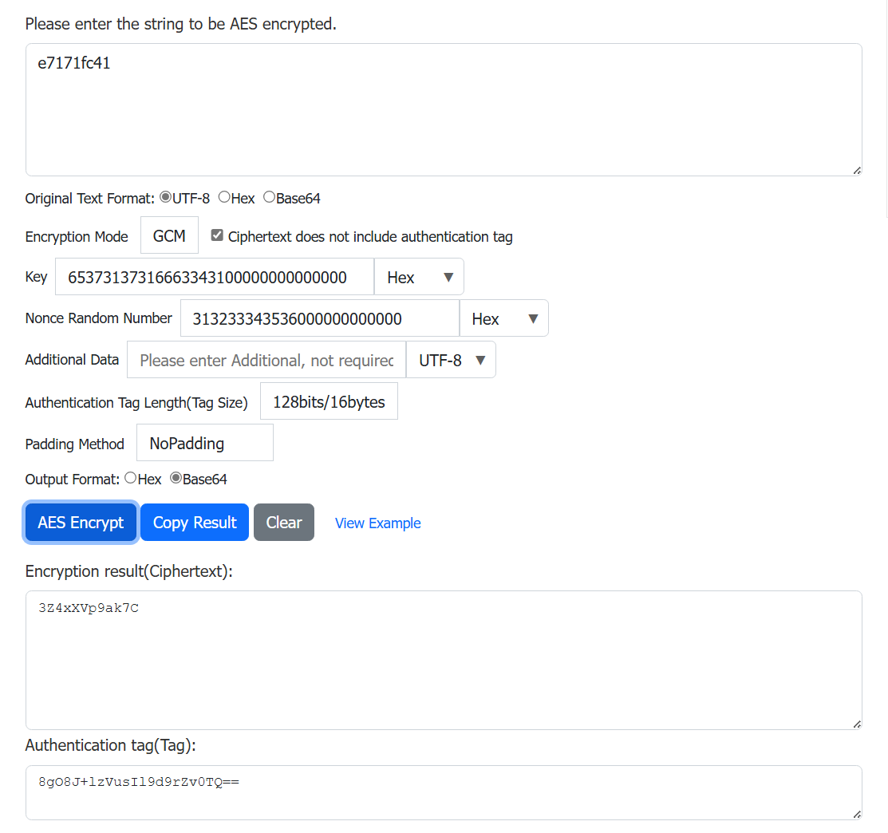
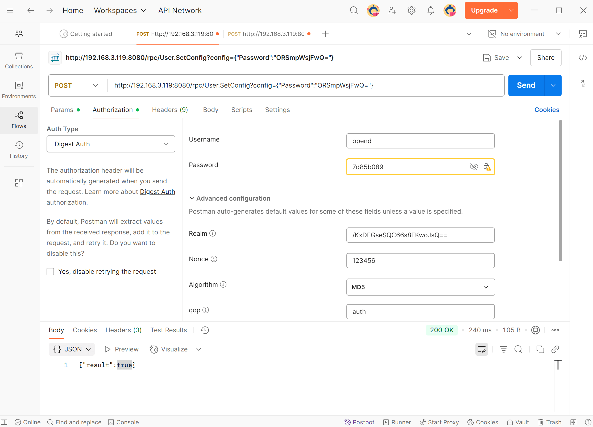

# OpenData

## 一、介绍

OpenData是为基于WiFi的Solarman物联网设备（如插座、电表、读表器等）设计的轻量级通信框架。设备通过WiFi接入本地网络，支持数据主动推送与外部查询响应。

### 核心功能

- **设备数据获取**：实时拉取设备基础信息（型号、固件版本等）、测量数据。
- **设备配置更新**：动态调整设备参数及配置。

### 使用场景

1. **推送设备数据（UDP）**
    - 不加密：UDP广播至 255.255.255.255
    - 设备Key加密：UDP广播至 255.255.255.255（暂不支持，敬请期待）

2. **接收外部查询请求（HTTP/HTTPS）**
    - HTTP：无加密认证，明文传输
    - HTTP + Digest：Digest认证
    - HTTPS：TLS/SSL加密（暂不支持，敬请期待）


## 二、准备

### 1. 安装工具

- 任一网络调试工具（如[NetAssist](https://www.cmsoft.cn/resource/102.html)）：用于接收UDP广播。
- [Postman](https://www.getpostman.com/)：用于调用HTTP API获取设备信息或更新设备配置。

### 2. 开启API

在默认状态下设备API功能关闭，需要手动开启后才能使用API。

### 3. 获取IP地址

以下四种方法任选其一：

- 路由器管理后台查询

- Solarman Smart APP查看设备详情

- Energy Ease查看设备信息

<details>
<summary>UDP广播获取IP</summary>

1. 确保设备接入的WiFi网络与电脑处于同一局域网。

2. 打开网络调试工具。

3. 选择**UDP**协议。
    

4. 选择**本机地址**。
    

5. 设置**端口**号为**10000**。
    

6. 单击**打开**。
    

7. 在远程主机设置广播地址及端口：**255.255.255.255:8099**。
    

8. 在消息框里填写AT指令：**AT+IGDEVICEIP**。
    

9. 单击“**Send**”。

10.  同一局域网内的Solarman设备会回复其IP地址和SN号。
    

</details>


## 三、UDP使用说明

### 开启功能

UDP默认状态为关闭，需要手动开启UDP。

### UDP不加密

对于支持UDP广播服务的设备，您可通过接收UDP报文来获取设备信息。

| 设备         | 广播地址及端口                        | 发送频率（ms） |
| ------------ | ------------------------------------- | -------------- |
| P1读表器     | 广播地址：255.255.255.255；端口：8088 | 500            |
| 智能计量插座 | 广播地址：255.255.255.255；端口：8088 | 500            |
| 智能导轨电表 | 广播地址：255.255.255.255；端口：8088 | 200            |


**操作步骤**：

1. 确保设备和您的电脑连接到同一个路由器或同一个Wi-Fi热点。

2. 打开网络调试工具。

3. 在网络设置区域选择协议类型**UDP**。
    

4. 在本地主机地址选项中，选择您电脑在当前局域网的**IP地址**。
    

5. 设置本地**端口**号为**8088**。

6. 点击“**Open**”开始监听。

7. 在接收设置区域可选择报文显示格式：ASCII、Hex。

8. 接收区将显示收到的广播报文。


:::info 注意
如果接收区无数据，请检查设备与电脑是否处于同一个局域网下，并确保防火墙允许该网络通信。
:::

### UDP 设备key加密
暂不支持，敬请期待

## 四、HTTP使用说明

### 请求结构

#### 请求方法
- **GET**：请求服务器返回指定资源。
- **POST**：请求服务器执行特定操作。

#### 请求地址

```
http://{IP_ADDRESS}:8080/rpc/{API}
```
- `{IP_ADDRESS}`：设备的IP地址。
- `{API}`：调用的HTTP API。

### 请求示例
- 获取设备信息：

```
GET http://192.168.31.213:8080/rpc/Sys.GetConfig
```
- 修改设备名称：

```
POST http://192.168.31.213:8080/rpc/Sys.SetConfig?config={"device":{"hostname":"admin"}}
```

### Digest认证
Digest认证技术用于网络通信中验证用户身份，避免密码明文传输。

:::info 注意
在HTTP+Digest模式下，首次使用或恢复出厂设置的设备需要先修改默认密码才能使用其他接口。
:::

#### 修改密码
1. 在Postman选择**Authorization**标签。

2. 在**Auth Type**下拉框选择**Digest Auth**。

3. 使用在线AES加密工具生成Base64格式的加密密码和Tag值。

    **所需在线工具**：
    - ASCII转Hex
    - Hex转Base64
    - AES_GCM加密工具

    **加密所需信息如下**：
    - 明文：新密码。
    - 密钥：当前密码，格式：Hex，不足16字节需在末尾补00，直至达到16字节。
        示例：默认密码e7171fc41转为65373137316663343100000000000000。
    - Nonce：随机值，格式：Hex，不足12字节需在末尾补00，直至达到12字节。
        示例：nonce是123456转为313233343536000000000000。
    - 填充方式：NoPadding。
    - 其他不填。
  

4. 认证信息见下表：

   | 字段         | 值                                |
   | ------------ | --------------------------------- |
   | Username     | 默认opend                         |
   | Password     | 默认设备KEY                       |
   | Realm        | AES128-GCM生成的tag值，Base64格式 |
   | Nonce        | 随机值，与AES加密随机值保持一致   |
   | Algorithm    | MD5                               |
   | qop          | auth                              |
   | Nonce Count  | 随机值                            |
   | Client Nonce | 随机值                            |
   | Opaque       | 不填                              |

5. 在HTTP方法下拉框选择**POST**请求。


6. 请求地址为：

    ```
   http://{IP_ADDRESS}:8080/rpc/User.SetConfig?config={"Password":"{PASSWORD}"}
   ```
   其中：
   - `{IP_ADDRESS}`：设备IP地址。
   - `{PASSWORD}`：AES128-GCM加密后的Base64格式密文。
   


7. 单击**Send**。


> &#x2705; **成功**
>
> 收到`{"result": true}`，修改密码成功。

#### 请求其他接口
1. 在Postman选择**Authorization**标签。

2. 在**Auth Type**下拉框选择**Digest Auth**。

3. 认证信息见下表：

   | 字段         | 值                              |
   | ------------ | ------------------------------- |
   | Username     | 默认opend                       |
   | Password     | 修改后的设备密码                |
   | Realm        | 随机值                          |
   | Nonce        | 用于加密当前密码的AES加密随机值 |
   | Algorithm    | MD5                             |
   | qop          | auth                            |
   | Nonce Count  | 随机值                          |
   | Client Nonce | 随机值                          |
   | Opaque       | 不填                            |

### HTTPS
暂不支持，敬请期待

### 错误码

| 错误码 | 描述                                          | 说明                                                       |
| ------ | --------------------------------------------- | ---------------------------------------------------------- |
| 400    | Bad Request（错误请求）                       | 服务器无法理解请求的格式，客户端应当修改请求后再尝试。     |
| 401    | Unauthorized（未授权）                        | 请求要求身份验证，客户端需要提供有效的凭据。               |
| 403    | Forbidden（禁止）                             | 服务器理解请求，但拒绝执行，通常是由于权限问题。           |
| 404    | Not Found（未找到）                           | 服务器无法找到请求的资源，可能是因为资源不存在或已被删除。 |
| 405    | Method Not Allowed（方法不允许）              | 请求的方法与资源不兼容，例如对只读资源执行写操作。         |
| 408    | Request Timeout（请求超时）                   | 服务器在等待请求时超时，客户端可以稍后重试。               |
| 409    | Conflict（冲突）                              | 请求与资源的当前状态存在冲突，例如多用户同时编辑同一资源。 |
| 410    | Gone（已删除）                                | 请求的资源已被永久删除，且没有新的地址。                   |
| 500    | Internal Server Error（内部服务器错误）       | 服务器遇到未知错误，无法完成请求。                         |
| 501    | Not Implemented（未实现）                     | 服务器不支持请求的方法，无法执行。                         |
| 502    | Bad Gateway（错误网关）                       | 服务器作为网关或代理，从上游服务器收到无效响应。           |
| 503    | Service Unavailable（服务不可用）             | 服务器当前无法处理请求，可能是由于过载或维护。             |
| 504    | Gateway Timeout（网关超时）                   | 服务器作为网关或代理，未能及时从上游服务器获得响应。       |
| 505    | HTTP Version Not Supported（HTTP 版本不支持） | 服务器不支持请求中使用的 HTTP 版本。                       |

## 五、HTTP API
| 组件          | 说明                                             |
| ------------- | ------------------------------------------------ |
| [Sys](#sys)   | 提供有关设备型号、固件版本等信息。               |
| [P1](#p1)     | 从P1读表器读取电表用气信息。                     |
| [Plug](#plug) | 读取智能计量插座获取当前功率信息，控制插座通断。 |

### Sys

#### 获取设备信息

- 请求示例

```
GET http://192.168.31.213:8080/rpc/Sys.GetConfig
```

- 返回值示例

```json
{
    "device": {
        "hostname": "admin",
        "timezone": 480,
        "type": "",
        "sn": "2730890019",
        "mac": "E8FDF8DD9A76",
        "fw": "LSW3_01_E030_SS_00_00.00.00.03",
        "time": "2024-11-26 19:14:23",
        "time_stamp": 1732648463,
        "run_time": 839
    }
}
```

> **方法：Sys.GetConfig**
>
> - 返回值
>
> | 参数名 | 参数类型 | 说明                        |
> | ------ | -------- | --------------------------- |
> | device | object   | 详情见[Config](#config)表格 |

#### 设置设备名称、时区

- 请求示例

```
POST http://192.168.31.213:8080/rpc/Sys.SetConfig?config={"device":{"hostname":"admin"}}
```

- 返回值示例
```json
{"result": true}
```

> **方法：Sys.SetConfig**
>
> - 参数
>
> | 参数名 | 参数类型 | 说明                                                  |
> | ------ | -------- | ----------------------------------------------------- |
> | config | object   | 详情见[Config](#config)表格，只可修改设备名称、时区。 |
>
> - 返回值
>
> | 参数名 | 参数类型 | 说明                          |
> | ------ | -------- | ----------------------------- |
> | result | bool     | `true`：成功，`false`：失败。 |

#### Config
| 参数名 | 参数类型 | 说明                   |
| ------ | -------- | ---------------------- |
| device | object   | 设备配置信息，见下表。 |

device参数说明

| 参数名     | 参数类型 | 说明                   | 读写属性 |
| ---------- | -------- | ---------------------- | -------- |
| hostname   | string   | 设备名称               | R/W      |
| timezone   | int      | 时区                   | R/W      |
| type       | string   | 设备型号               | R        |
| sn         | string   | 设备编码               | R        |
| mac        | string   | 设备mac地址            | R        |
| fw         | string   | 设备固件版本号         | R        |
| time       | string   | 设备当前时间           | R        |
| time_stamp | int      | 设备当前时间戳         | R        |
| run_time   | int      | 设备运行时间（单位秒） | R        |


### P1

#### 获取读表器Json数据

- 请求示例

```
GET http://192.168.31.213:8080/rpc/P1.JsonData
```

- 返回值示例
```json
{
    "SN": "E0036003765928016",
    "Device_Version ": "50",
    "Device_Type": 0,
    "Electricity delivered to client_low tariff": 53754.58,
    "Electricity delivered to client_normal tariff": 9818.93,
    "Electricity delivered by client_low tariff": 53754.58,
    "Electricity delivered by client_normal tariff": 9818.93,
    "AC_Phase-A_Current ": 12,
    "AC_Phase-B_Current": 0,
    "AC_Phase-C_Current": 0,
    "AC_Phase-A_Voltage": 237,
    "AC_Phase-B_Voltage": 237,
    "AC_Phase-C_Voltage": 236,
    " Actual electricity power delivered +P ": 0,
    " Actual electricity power received -P ": 2.94,
    "Instantaneous active power L1 +P": 0,
    "Instantaneous active power L2 +P": 0,
    "Instantaneous active power L3 +P": 0,
    "Instantaneous active power L1 -P": 2.95,
    "Instantaneous active power L2 -P": 0,
    "Instantaneous active power L3 -P": 0
}
```

> **方法：P1.JsonData**
>
> - 返回值: Json格式的电表数据。
>
> | 参数名                                        | 说明                 | 单位 |
> | --------------------------------------------- | -------------------- | ---- |
> | SN                                            | 当前电表设备SN       | -    |
> | Device_Version                                | 当前电表版本         | -    |
> | Device_Type                                   | 当前电表设备型号     | -    |
> | Electricity delivered to client_low tariff    | 正向低费率累计电能   | kWh  |
> | Electricity delivered to client_normal tariff | 正向正常费率累计电能 | kWh  |
> | Electricity delivered by client_low tariff    | 反向低费率累计电能   | kWh  |
> | Electricity delivered by client_normal tariff | 反向正常费率累计电能 | kWh  |
> | AC_Phase-L1_Current                           | 交流 A 相电流        | A    |
> | AC_Phase-L2_Current                           | 交流 B 相电流        | A    |
> | AC_Phase-L3_Current                           | 交流 C 相电流        | A    |
> | AC_Phase-L1_Voltage                           | 交流 A 相电压        | V    |
> | AC_Phase-L2_Voltage                           | 交流 B 相电压        | V    |
> | AC_Phase-L3_Voltage                           | 交流 C 相电压        | V    |
> | Actual electricity power delivered +P         | 正向总有功功率       | kW   |
> | Actual electricity power received -P          | 反向总有功功率       | kW   |
> | Instantaneous active power L1 +P              | 购电有功功率 L1      | kW   |
> | Instantaneous active power L2 +P              | 购电有功功率 L2      | kW   |
> | Instantaneous active power L3 +P              | 购电有功功率 L3      | kW   |
> | Instantaneous active power L1 -P              | 并网有功功率 L1      | kW   |
> | Instantaneous active power L2 -P              | 并网有功功率 L2      | kW   |
> | Instantaneous active power L3 -P              | 并网有功功率 L3      | kW   |
> | Total Gas Consumption                         | 总燃气消耗量         | m³   |


#### 获取读表器源数据

- 请求示例

```
GET http://192.168.31.213:8080/rpc/P1.GetData
```

- 返回值示例
```json
{
    3:0.2.8(50)
    0-0:1.0.0(181106140429W)
    0-0:96.1.1(31333631353032362020202020202020)
    1-0:1.8.1(10830.511*kWh)
    1-0:1.8.2(002948.827*kWh)
    1-0:2.8.1(001285.951*kWh)
    1-0:2.8.2(002876.514*kWh)
    0-0:96.14.0(0002)
    1-0:1.7.0(21.100*kW)
    1-0:2.7.0(00.000*kW)
    0-0:96.7.21(00006)
    0-0:96.7.9(00003)
    1-0:99.97.0(1)(0-0:96.7.19)(180529135630S)(0000002451*s)
    1-0:32.32.0(00003)
    1-0:52.32.0(00002)
    1-0:72.32.0(00002)
    1-0:32.36.0(00001)
    1-0:52.36.0(00001)
    1-0:72.36.0(00001)
    0-0:96.13.0()
    1-0:32.7.0(236.0*V)
    1-0:52.7.0(232.6*V)
    1-0:72.7.0(235.1*V)
    1-0:31.7.0(002*A)
    1-0:51.7.0(000*A)
    1-0:71.7.0(000*A)
    1-0:21.7.0(00.000*kW)
    1-0:41.7.0(00.033*kW)
    1-0:61.7.0(00.132*kW)
    1-0:22.7.0(00.676*kW)
    1-0:42.7.0(00.000*kW)
    1-0:62.7.0(00.000*kW)
    0-1:24.1.0(003)
    0-1:96.1.0(4730303339303031373030343630313137)
    0-1:24.2.1(210606140010W)(02569.646*m3)
    !1F28
}
```
> **方法：P1.GetData**
> - 返回值：设备获取的电表源数据。

### Plug

#### 获取电器耗电情况

- 请求示例

```
GET http://192.168.31.213:8080/rpc/Plug.GetData
```

- 返回值示例
```json
{
    "voltage": 230,
    "electric_current": 0,
    "positive_active_energy": 1.730654,
    "reverse_active_energy": 0.000000,
    "power": 1.217517
}
```

> **方法：Plug.GetData**
> - 返回值
>
> | 参数名                 | 参数类型 | 说明           | 单位 |
> | ---------------------- | -------- | -------------- | ---- |
> | voltage                | int      | 电压           | V    |
> | electric_current       | int      | 电流           | A    |
> | positive_active_energy | float    | 正向有功总电能 | kWh  |
> | reverse_active_energy  | float    | 反向有功总电能 | kWh  |
> | power                  | float    | 有功功率       | W    |


#### 获取插座通断状态

- 请求示例

```
GET http://192.168.31.213:8080/rpc/Plug.GetStatus
```

- 返回值示例
```json
{"switch_status": "on"}
```

> **方法：Plug.GetStatus**
> - 返回值
>
> | 参数名        | 参数类型 | 说明                      |
> | ------------- | -------- | ------------------------- |
> | switch_status | string   | `on`：打开，`off`：断开。 |


#### 设置插座通断

- 请求示例

```
POST http://192.168.31.213:8080/rpc/Plug.SetStatus?config={"switch_status":"on"}
```

- 返回值示例
```json
{"result": true}
```

> **方法：Plug.SetStatus**
> - 参数
>
> | 参数名 | 参数类型 | 说明                                              |
> | ------ | -------- | ------------------------------------------------- |
> | config | object   | 设置插座通断状态，详情见[Config](#config-1)表格。 |
>
> - 返回值
>
> | 参数名 | 参数类型 | 说明                          |
> | ------ | -------- | ----------------------------- |
> | result | bool     | `true`：成功，`false`：失败。 |

#### Config

| 参数名                          | 参数类型 | 说明                                    | 单位 | 读写属性 |
| ------------------------------- | -------- | --------------------------------------- | ---- | -------- |
| voltage                         | int      | 电压                                    | V    | R        |
| current                         | int      | 电流                                    | A    | R        |
| Electricity delivered to client | float    | 正向有功总电能                          | kWh  | R        |
| Electricity delivered by client | float    | 反向有功总电能                          | kWh  | R        |
| Active power                    | float    | 有功功率                                | W    | R        |
| switch_status                   | string   | 插座通断控制：`on` - 打开，`off` - 断开 | -    | R/W      |


### Meter

#### 获取电表Json数据

- 请求示例

```
GET http://192.168.31.213:8080/rpc/Meter.JsonData
```

- 返回值示例
```json
{
    "SN": "3310500113",
    "voltage": 229.87,
    "current": 0.66,
    "active power": 133.50,
    "apparent power": 209.60,
    "reactive power": -29.80,
    "power factor": 0.63,
    "frequency": 50.03,
    "total_act_energy": 3.53,
    "total_act_ret_energy": 0.18
}
```

> **方法：Meter.JsonData**
> - 返回值：Json格式的电表数据。
>
> 单相电表Json数据
>
> | 参数名               | 说明           | 单位 |
> | -------------------- | -------------- | ---- |
> | SN                   | 设备SN         | -    |
> | current              | 电流           | A    |
> | voltage              | 电压           | V    |
> | frequency            | 交流频率       | Hz   |
> | power factor         | 功率因数       | -    |
> | active Power         | 正反向有功功率 | W    |
> | apparent power       | 正反向视在功率 | W    |
> | reactive power       | 正反向无功功率 | W    |
> | total_act_energy     | 总正向有功电能 | kWh  |
> | total_act_ret_energy | 总反向有功电能 | kWh  |


## 六、设备

### P1读表器

P1读表器（P1-2W）通过RJ12接口与单台P1电表直连，持续采集电表工作状态与用电数据，实现对电表系统的长效监控。该设备将采集的数据通过WiFi无线传输至本地或云端平台，通过可视化图表动态呈现电表实时状态与历史用电趋势。

P1读表器支持以下组件功能：
- Sys
- P1

### 智能计量插座

智能计量插座（SP-2W-EU）适用于各种家庭用电场景，具备双向计量和远程控制功能。通过WiFi连接，实时上传能耗数据至本地/云端平台。用户可通过手机或电脑远程控制插座来通断连接电器，并监控电器的使用情况，从而实现能效管理自动化。

智能计量插座支持以下组件功能：
- Sys
- Plug

### 智能导轨电表

智能导轨电表专为户用及小型工商业双向电能计量设计，采用开口式互感器接入，符合DIN 35mm导轨安装标准。通过WiFi/Ethernet连接，实时上传数据至本地或远程软件平台，实现电能使用的详细监测与分析。

智能导轨电表包含以下型号（其中MR1对应单相电表，MR3对应三相电表）：
- MR1-D5-WR
- MR1-D5-W

智能导轨电表支持以下组件功能：
- Sys
- Meter
